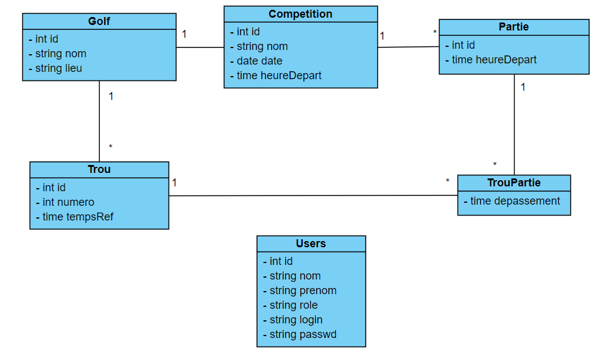
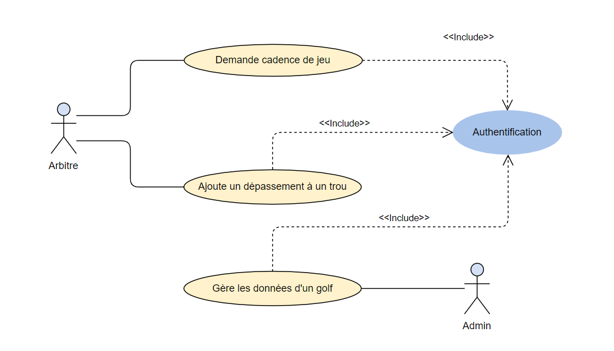
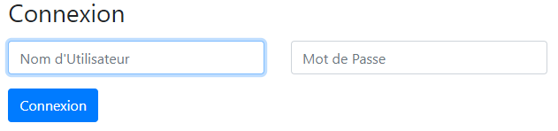
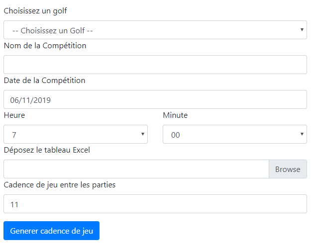
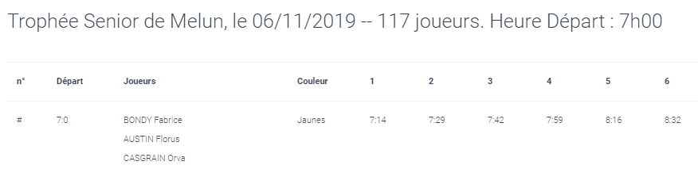
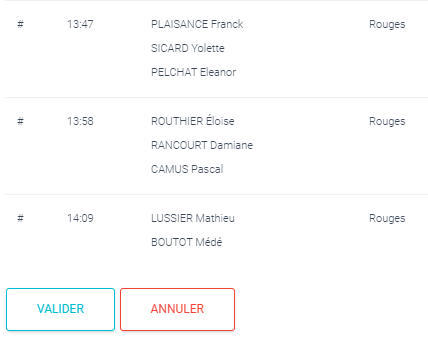
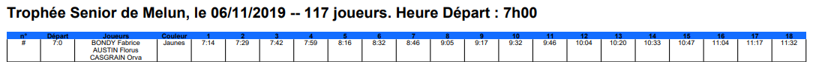

<h1 align="center">PROJET PRAGOLF</h1>

 
 
 
 

Gestion de cadences de jeu pour compétitons amateurs de la FFGolf.
 - Symfony 4.3
 - PHP 7.3.1 

### **Auteurs**

Yahia Lamri - Stanislas Raczynski

### **Etat du projet**

Completed

### **Description**

Ce projet à pour but de générer un tableau comprenant les heures de départ ainsi que les cadences de jeu de toutes les parties (équipes) d'une journée de compétition d'un tournoi de golf. 

Le tableau est généré depuis un fichier excel fourni par la FFGolf

Projet commandé par la FFGolf.

### **Mise en place, utilisation**

Le client se connecte à l'application stockée sur un serveur distant via son
navigateur internet. Il se connecte grâce à son username et mot de passe, et 
soumet l'horaire de départ de la première partie de la compétition. Il soumet 
ensuite l'écart qu'il souhaite appliquer entre chaque départ de parties. Il
upload dans un dernier temps la liste des joueurs inscrits à la compétition 
qui lui est fourni par la FFGolf. Un tableau de cadence de jeu lui est proposé 
une fois ces trois actions terminées, si l'arbitre (client) pense que le tableau
est correct, il le valide, et récupère ensuite un fichier PDF qu'il peut
imprimer pour gérer la compétition.

### **LICENCE**

Projet réalisé sous la Licence MIT

### **DOCUMENTATION**

*Diagramme des classes :* 

*Diagramme de cas d'utilisation :*

### **Utilisation de l'application**

L'utilisateur doit en premier se connecter avec son nom d'utilisateur et son
mot de passe. 

Une fois connecté l'arbitre peut ensuite se rendre sur le formulaire lui 
permettant de renseigner le nom du golf sur lequel se déroule la compétition, de saisir
le nom de la compétition, sa date, son heure de départ, de renseigner combien de temps
doit être laissé entre chaque parties, et enfin d'ajouter le fichier Excel contenant
la liste des joueurs fournies par la FFGolf.

Après cela le tableau contenant les cadences de jeu est créé dans la page suivante
avec pour possibilité pour l'arbitre de valider ou non si le tableau lui convient.

Si le tableau convient à l'arbitre, il est alors généré par l'application pour
être imprimé par l'arbitre.

Une fois validé, un tableau PDF au format suivant est généré (ci-dessous une seule ligne y figure le tableau comprend une quarantaine de lignes) : 

